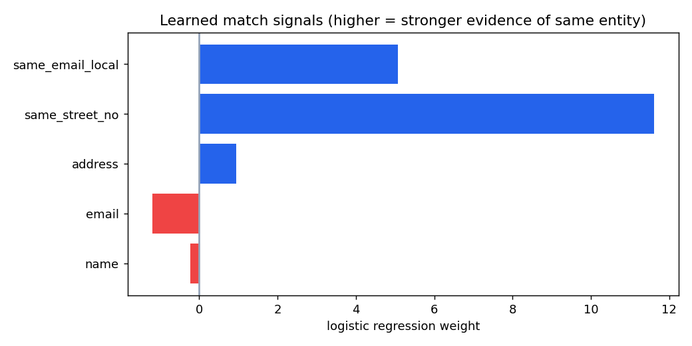

# Entity Resolution Engine

Deduplicate and link records that refer to the same real person despite typos, nicknames, and formatting drift. A supervised record-linkage pipeline: **blocking** to scale, fuzzy + crisp **similarity features**, a learned **classifier**, and graph **clustering** into resolved entities — scored against ground truth.

"Are these two rows the same customer?" is one of the most common and most botched problems in data engineering. This solves it the principled way.

---

## Results

2,405 messy records hiding 1,500 true entities (905 duplicates with typos, nicknames, email drift, and abbreviated addresses):

| Stage | Precision | Recall | F1 |
|---|---|---|---|
| Pair classifier (held-out pairs) | **0.997** | **1.000** | **0.998** |
| End-to-end clustering | 0.992 | 0.839 | **0.909** |

**Blocking cut comparisons by 97.5%** — from 2.89M naive all-pairs down to 72k candidates — without which the pipeline wouldn't scale past a toy dataset.



The classifier learned exactly the right thing: **same street number** and **same email local-part** are the dominant evidence (weights 11.6 and 5.1), while fuzzy name similarity is nearly discounted — because two *different* people can share a name, but rarely a street number *and* an email handle.

---

## Why the two-number story matters

- **Pair classifier F1 = 0.998** — given two records, the model decides "same or not" almost perfectly.
- **Clustering F1 = 0.909** — the lower recall is honest and expected: records whose corruptions pushed them into *different blocks* never get compared, so a few duplicates are missed. That's the fundamental blocking trade-off (speed vs completeness), not a modeling failure — and naming it is the difference between understanding the pipeline and just running it.

---

## Pipeline

```
records.csv
   │
   ▼ blocking          group by (name initial + city prefix) → 72k candidate pairs
   ▼ featurize         name / email / address fuzzy ratios + same-street-no + same-email-local
   ▼ classify          logistic regression (Fellegi-Sunter style), held-out evaluation
   ▼ cluster           connected components of predicted matches = resolved entities
   ▼ evaluate          pairwise precision / recall / F1 vs ground-truth entity_id
```

---

## Stack

`Python` · `scikit-learn` · `RapidFuzz` (Jaro-Winkler / token ratios) · `networkx` · supervised record linkage

---

## Run it

```bash
pip install -r requirements.txt
python src/generate_records.py   # 2.4k records with realistic duplicate corruptions
python src/resolve.py            # block → featurize → classify → cluster → score
```

---

## Notes

- The crisp features (`same_street_no`, `same_email_local`) are what lift precision from ~0.5 (fuzzy ratios alone) to ~0.99 — encoding domain knowledge beats throwing more string distance at the problem.
- Tighter blocking keys trade recall for speed; phonetic (Soundex) or sorted-neighborhood blocking would recover some of the missed pairs.
